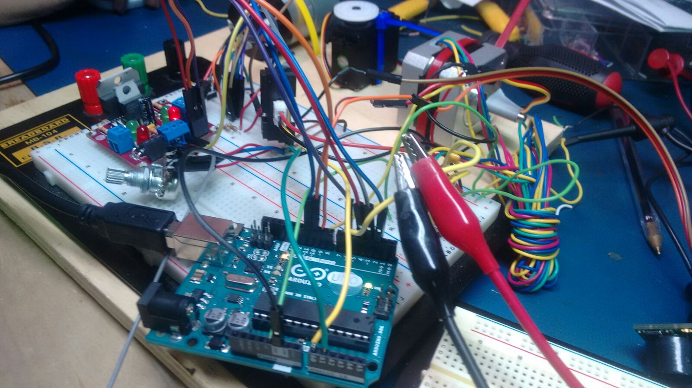
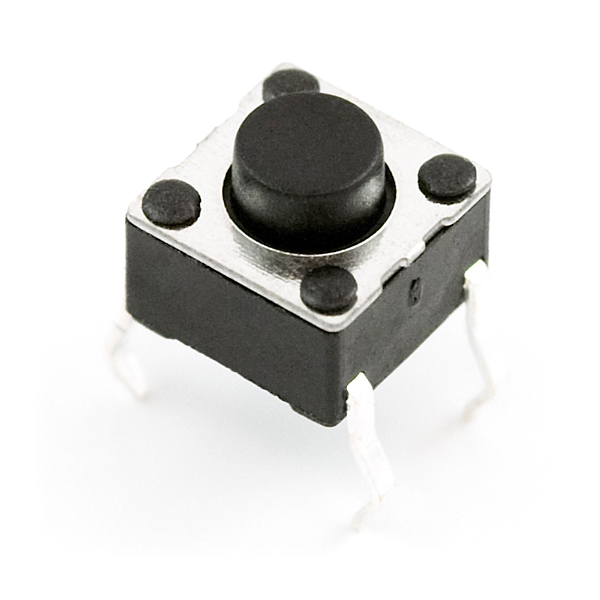
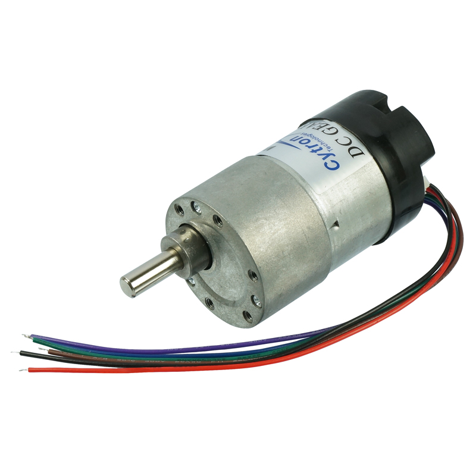
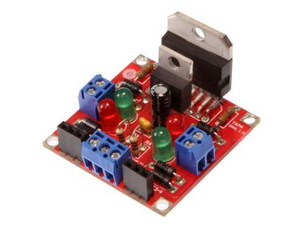
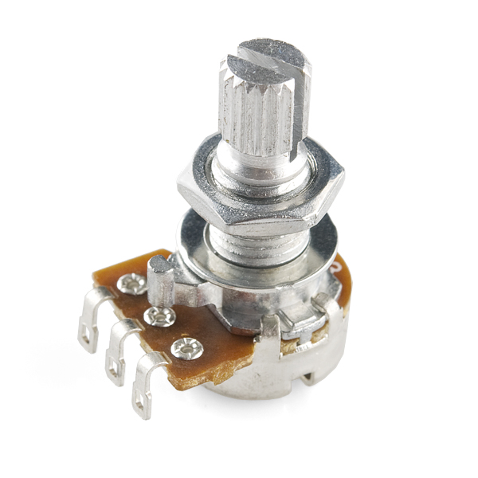
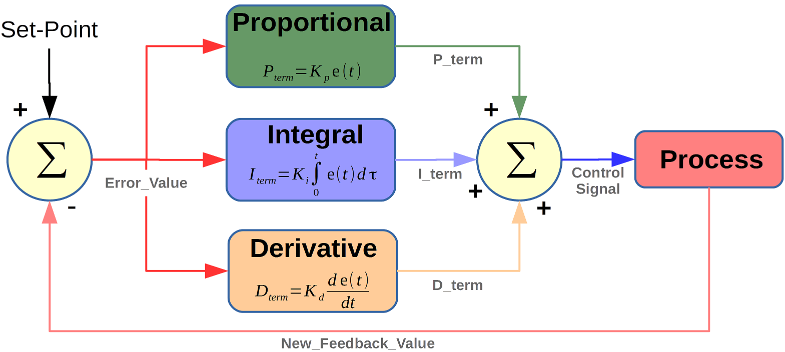
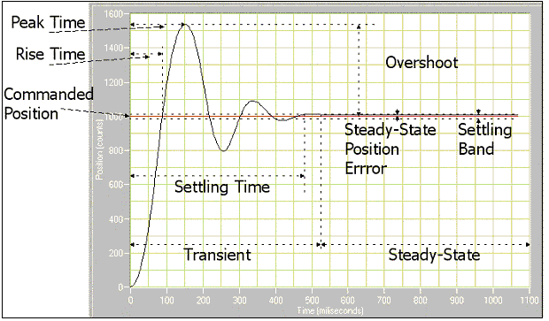

**DC Motor Control**
Implements debouncing for push button switch, speed control of DC motor using potentiometer as sensor and PID control of DC motor via GUI input. 

**Part 1: Debouncing using Push Button Switch**

What is debouncing? Why is it important?

Pushbutton[1]s  generate spurious open/close transitions when pressed which may be read as multiple presses in a very short time. Debouncing is the act of measuring input only once within a fixed short period of time. Without debouncing, pressing the button causes unpredictable results.

Fig 1: Standard push button switch[2]

Here, the push button was connected to an interrupt pin which read HIGH/LOW once every 0.05 seconds, depending on when it&#39;s pressed. This was used to switch between different states, such as GUI/sensor control.

Pseudo code:

loop{

reading = digitalRead(pin);

if(reading != previous1)

  {

    if (reading == HIGH)

      changeState();

    delay(50);

  }

  previous1=reading1;

}

**Part 2: DC Motor Velocity Control using Potentiometer**

The DC motor converts electrical energy into mechanical energy by force on a current carrying arm in a magnetic field.   We used the SPG30-60K motor[3] with mounted encoder shown in Figure 2. It has a rated voltage of 12V and rated speed of 12RPM.

Figure 2: DC motor with encoder[3]

We used L298 motor driver, shown in figure 3, to control the DC motor.

Figure 3: L298 Compact Motor Driver[4]

The logic was controlled by two motor driver pins(L1,L2) and an Enable pin.

| E | L1 | L2 | Result | E | L1 | L2 | Result |
| --- | --- | --- | --- | --- | --- | --- | --- |
| 0 | 0 | 0 | Brake | 1 | 0 | 0 | Brake |
| 0 | 0 | 1 | Brake | 1 | 0 | 1 | Forward |
| 0 | 1 | 0 | Brake | 1 | 1 | 0 | Backward |
| 0 | 1 | 1 | Brake | 1 | 1 | 1 | Brake |

We used a rotary potentiometer to control motor.

Figure 4: Rotary Potentiometer[5]

At its core, it is a three terminal resistor with a sliding or rotating contact that forms an adjustable voltage divider. When connected across a voltage(5V here) it read a value between 0 and 1023 when turned. This value was suppressed within 0-255 and written into the Enable pin as a PWM wave. Thereby, turning the motor alters voltage across motor and changes speed. _The transfer function of this sensor is linear._

**Part 3: DC Motor Position Control using PID**

The PID control algorithm responds to proportional, integral and differential error.

The respective coefficients are non-negative.

Figure 5: Schematic of PID Control Algorithm[6]

A typical response curve looks like Figure 6

Figure 6: Response Curve of PID control

Here, _settling time_ is determined by Kp, _steady state oscillations_ by Kd and _offset_ at steady state by Ki. By regulating three values one can obtain a desired response curve.

On rotary encoders

Here, error is given by a rotary encoder, that converts angular position to digital signal. One of the encoder pins was connected to an interrupt pin on Arduino to check for position change. At the interrupt, the two pins are read, and if their values differ, it indicates a change in position. This change is tracked to get measure the actual position of the motor and sent as feedback to the network.

**Interesting Observations and Inferences**

1. It was found that for low PWM cycles, the DC motor wouldn&#39;t move. If PWM value was less than 116, the motor stood stand still. At 116, there is an abrupt change in voltage across the motor. This was a non linearity in motor behaviour. When motor was still at non zero PWM voltage, one could observe a high pitched sound that increases with voltage that perhaps dissipated power and signified interference with other armatures/fields on board.
2. The encoder caused too much noise when not used in combination with a pull up resistor. Therefore it is advised to pull up both the encoder pins.
3. At high velocities(PWM) the DC motor stabilised with a lot of jerks, this was caused by overshooting desired value.
4. While the PID control worked perfectly on its own, when integrated with circuit, it continuously oscillated without stabilising. We figured this happened due to excessive loop time, ie, since the PWM was updated at every iteration of the loop, when the loop takes long to execute, the motor has already overshot the desired value. This continuous for subsequent updates, putting the motor in a steady state large oscillation. To tackle this, we optimized code to prevent unnecessary if and for conditions, and applied timeout to functions like Serial.readString(). Lower the timeout, better was stabilisation.
5. While doing hardware integration involving components designed by others, one should always take pictures before removing wires/moving components.

**References**

1. [https://www.arduino.cc/en/Tutorial/Debounce](https://www.arduino.cc/en/Tutorial/Debounce)
2. [https://www.sparkfun.com/products/97](https://www.sparkfun.com/products/97)
3. [https://robu.in/product/dc-geared-motor-encoder-12-rpm-120n-cm-12v-spg30e-270k/](https://robu.in/product/dc-geared-motor-encoder-12-rpm-120n-cm-12v-spg30e-270k/)
4. [https://solarbotics.com/product/k\_cmd/](https://solarbotics.com/product/k_cmd/)
5. [https://www.sparkfun.com/products/9939](https://www.sparkfun.com/products/9939)
6. [https://www.mathworks.com/matlabcentral/fileexchange/58257-unified-tuning-of-pid-load-frequency-controller-for-multi-area-power-systems-via-imc](https://www.mathworks.com/matlabcentral/fileexchange/58257-unified-tuning-of-pid-load-frequency-controller-for-multi-area-power-systems-via-imc)

